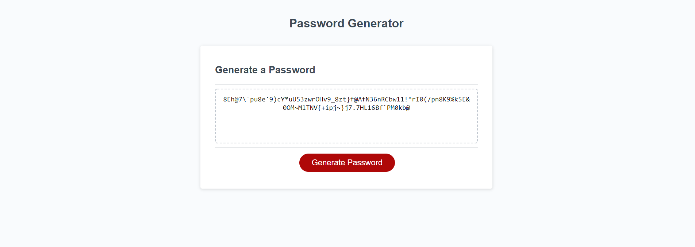

# Password Generator

## Purpose
A javascript password generator that generates a random
password based on user preferences, of lengths 8-128 inclusive.

## Built With
* HTML 
* CSS
*Javascript

## Screenshots

## Website
https://dpapert1995.github.io/pass-gen-dp/

## Contribution
Authors: Daniel Papert
© 2022